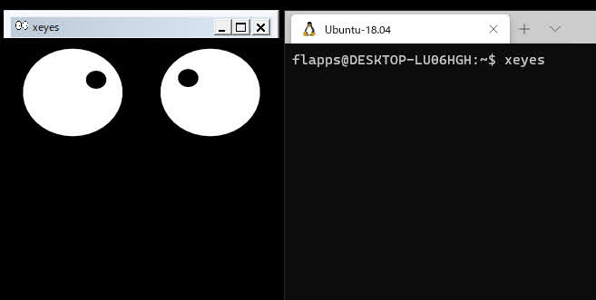

# WSL2用のDockerfile

WSL2上でGUI環境や日本語入力に必要なパッケージをDockerfileにまとめました。

## 動作環境
- Windows 10。Windows Subsystem for Linux 2へ更新済みなこと
- Windowsへ[Docker Desktop](https://www.docker.com/products/docker-desktop) を導入済み(もしくはいずれかの環境にてdockerが利用できること)

## 使い方

各コマンドに記載している`workspace`は適宜変更が可能です。

### 既存のWSL環境にてイメージファイルの作成
- docker build時に`build-arg`によって指定したユーザーが作られます。省略した場合の初期値は記載している値と同様です。

```shell
$ git clone git@github.com:s1140227/wsl2-jp-genie.git
$ cd wsl2-jp-genie
$ docker build \
      -t workspace \
      --build-arg USERNAME='user' \
      --build-arg PASSWORD='user' \
      --build-arg ROOT_PASSWORD='root' .
$ docker run --name workspace -it -d workspace
$ docker export --output workspace.tar workspace
$ mv workspace.tar /mnt/c/...
```

### PowerShellにてWSLにインポート

```powershell
PS > wsl --import workspace ./workspace .\workspace.tar
PS > wsl --list --verbose
  NAME                   STATE           VERSION
* Ubuntu-18.04           Running         2
  docker-desktop-data    Running         2
  docker-desktop         Running         2
  workspace              Stopped         2
```

Docker Desktopの初期設定ではdockerプロセスはデフォルト設定されているWSLコンテナとのみ繋がっています。
必要に応じてデフォルト設定を変更してください。

```
PS > wsl --set-default workspace
```

## 特徴

- デスクトップ環境は入っておらずUbuntu 18.04のみで構成されています。
  - 必要に応じてお好きなデスクトップ環境を入れてください。
- 日本語環境としてfcitx-mozcを入れています。
  - `$ fcitx-config-gtk3` にてキー設定を変更できます。
- GUI環境(X Window System)としてx11-appsを入れています。
  - Windowsにて[VcXsrv](https://sourceforge.net/projects/vcxsrv/) などのXサーバーが起動している際 `$ xeyes` にて接続を確認できます。
  - VcXsrvの場合起動時に `Disable access control` をONにしてください。
  


- [systemd-genie](https://github.com/arkane-systems/genie) を導入済みです。
  - 起動時には`systemd`が利用できるシェルになります。
- [snapd](https://github.com/snapcore/snapd) を導入済みです。
  - [Snap Store](https://snapcraft.io/store) に掲載されているGUIアプリをインストールできます。
  - Sublime Textの例 `$ sudo snap install sublime-text --classic && subl`


